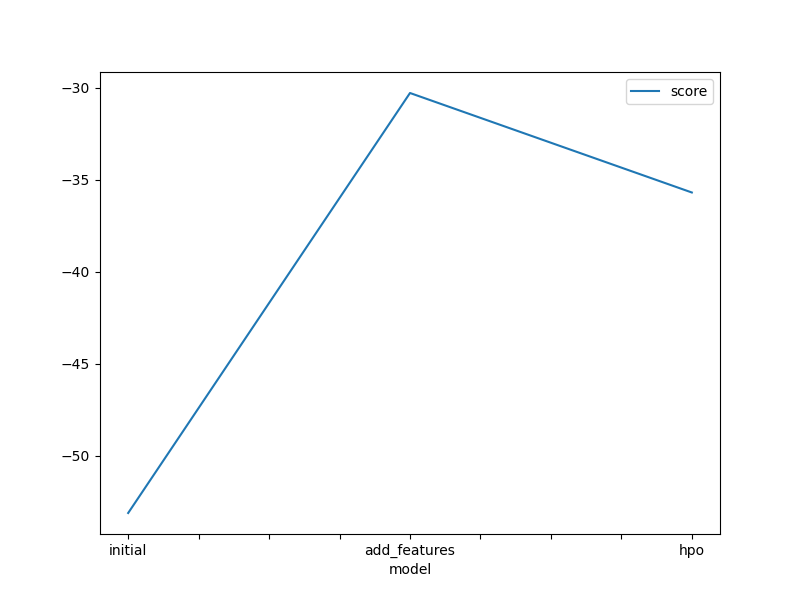
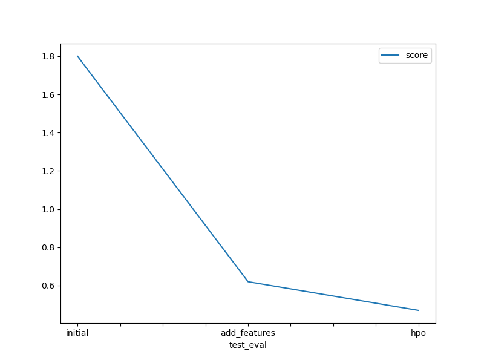

# Report: Predict Bike Sharing Demand with AutoGluon Solution
#### NAME HERE : ADITI KESARWANI

## Initial Training
### What did you realize when you tried to submit your predictions? What changes were needed to the output of the predictor to submit your results?
 1) negative values are not accepted by Kaggle : there were no negatives present through initial training
 2) submissions need to be submited in specified format(dataframe as SampleSubmission.csv) given by competion rules

### What was the top ranked model that performed?
  The WeightedEnsemble_L3 performed best with scovre val of -30.28 , in added features set training.
  

## Exploratory data analysis and feature creation
### What did the exploratory analysis find and how did you add additional features?
1) morning times between 6-10am and evening time 4-8 call for most customers where registered users with peaked usage.
2) clear skies calls for more riders 
3) Day if holiday have approx 100x more demand
4) dataset have equal distribution of season

Hour of usage really affected the renal frequency therefore this feature was added.

       

### How much better did your model preform after adding additional features and why do you think that is?
 
 my score improved from 1.80 in intial submission to 0.62 with additional features , this was because due to better representation of categorical values to AutoGluon and addion of hour feature in dataset.
 original features:
 
 		* ('float', [])                : 3 | ['temp', 'atemp', 'windspeed']
		* ('int', [])                  : 3 | ['season', 'weather', 'humidity']
 Modified and Added:

		* ('category', [])             : 2 | ['season', 'weather']
		* ('float', [])                : 3 | ['temp', 'atemp', 'windspeed']
		* ('int', [])                  : 2 | ['humidity', 'hour']

## Hyper parameter tuning
### How much better did your model preform after trying different hyper parameters?
my model score impoved to 0.47 which is much better than previous best score of 0.62 of added feature model.

### If you were given more time with this dataset, where do you think you would spend more time?
i want to perform more EDA and train on multiple hyperparameters like differnt deep Neural network models, XGBoost etc

### Create a table with the models you ran, the hyperparameters modified, and the kaggle score.

|model|	time|	num_boost_rounds|	num_echos|	score|
|--|--|--|--|--|
|0	|initial	|600	|default	|default	|1.80|
|1	|add_features|	600	|default	|default	|0.62|
|2	|hpo|	600|	100|	10|	0.47|

### Create a line plot showing the top model score for the three (or more) training runs during the project.

### Create a line plot showing the top kaggle score for the three (or more) prediction submissions during the project.

## Summary
In conclusion, this project involved experimenting with real-world data. Autogluon was employed to train and evaluate multiple models, selecting the one with the highest performance. Additional features were incorporated, and exploratory data analysis (EDA) along with data cleansing were conducted to address any anomalies in the dataset. Lastly, hyperparameters were optimized to enhance the overall performance of the model.

